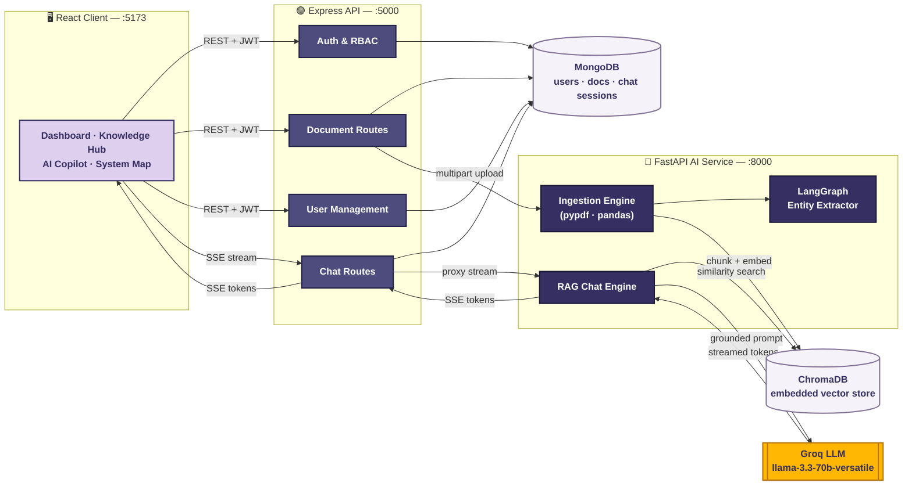

<div align="center">

# 🏭 Industrial Knowledge AI

**An AI-powered knowledge platform for industrial operations.**
Upload SOPs, manuals, inspection reports and maintenance logs — then ask questions about them in plain language through a document-aware AI Copilot.

[](https://react.dev)
[](https://expressjs.com)
[](https://fastapi.tiangolo.com)
[](https://www.mongodb.com)
[](https://www.trychroma.com)
[](https://groq.com)
[](#license)

</div>

---

## Table of Contents

- [Overview](#overview)
- [Architecture &amp; Node Flow](#architecture--node-flow)
- [Features](#features)
- [Tech Stack](#tech-stack)
- [Project Structure](#project-structure)
- [Getting Started](#getting-started)
- [How Authentication Works](#how-authentication-works)
- [How Chat Context Works](#how-chat-context-works)
- [Known Limitations](#known-limitations)
- [License](#license)

---

## Overview

Industrial Knowledge AI turns scattered plant documentation — PDFs, spreadsheets, inspection logs — into a searchable, conversational knowledge base. Engineers and technicians upload documents once; from then on, they can ask natural-language questions and get answers grounded directly in that documentation, with citations back to the source file.

The system is built as **three independent services** that talk to each other over HTTP:

| Service | Role |
|---|---|
| **`client/`** | React frontend — dashboards, document management, AI Copilot chat UI, system map |
| **`server/`** | Express + MongoDB API — auth, RBAC, document metadata, chat session persistence |
| **`ai/`** | FastAPI service — document parsing, chunking, embeddings, ChromaDB vector store, RAG chat, LangGraph entity extraction |

---

## Architecture &amp; Node Flow



**Two distinct paths through the system:**

- 🟣 **Ingestion path** — a document uploaded via `Document Routes` is forwarded to the AI service, where `pypdf`/`pandas` extract text, LangGraph pulls out structured entities, and the content is chunked and embedded into ChromaDB.
- 🧠 **Chat path** — a question hits `Chat Routes`, which proxies an SSE stream to the RAG engine. The engine runs a similarity search against ChromaDB (optionally scoped to one document), builds a grounded prompt, and streams the Groq LLM's response token-by-token back to the client.

---

## Features

- **📄 Document ingestion** — upload PDFs, Excel/CSV files; text is extracted, chunked, and embedded into a local ChromaDB vector store
- **🤖 AI Copilot** — ask questions in natural language; answers are generated by an LLM grounded in your ingested documents, with the option to scope a conversation to one or more specific files
- **💬 Persistent chat history** — conversations are saved per user, auto-titled after the first exchange, and can be resumed later
- **📚 Knowledge Hub** — browse, filter, and manage ingested documents by category and department
- **👥 User management** — registration goes through an admin-approval queue; admins can provision users directly, change roles, suspend/reactivate accounts, and view per-user activity
- **🔐 Role-based access** — Technician, Engineer, Manager, Compliance Officer, and Admin roles with route- and endpoint-level enforcement
- **🗺️ System Map** — a topology view linking equipment nodes to their governing SOP documents, with a shortcut into a document-scoped Copilot chat

> **Note:** OCR and two-factor authentication are represented as toggles in Settings but are **not yet implemented** — flagged there in the UI rather than silently doing nothing.

---

## Tech Stack

| Layer | Technology |
|---|---|
| Frontend | React 19, React Router, Tailwind CSS 4, Axios |
| Backend API | Node.js, Express 5, MongoDB (Mongoose), JWT auth |
| AI Service | FastAPI, LangChain, LangGraph, ChromaDB (embedded/local) |
| LLM | Groq — `llama-3.3-70b-versatile` |
| File parsing | `pypdf` (PDF text extraction), `pandas` (Excel/CSV → Markdown) |

---

## Project Structure

```
industrial-knowledge-ai/
├── client/          # React frontend
│   └── src/
│       ├── pages/           # Dashboard, AICopilot, KnowledgeHub, SystemMap, Settings...
│       ├── components/      # dashboard/, knowledge/, shared UI
│       ├── context/         # AuthContext
│       └── api/             # Axios instance
├── server/          # Express + MongoDB API
│   ├── controllers/         # user, chat, document, dashboard, systemMap, settings
│   ├── routes/
│   ├── models/
│   └── middleware/          # auth.js (JWT + RBAC), upload.js (multer)
└── ai/              # FastAPI service
    └── app/
        ├── routes/          # ingestion.py, chat.py
        ├── vector_engine.py # ChromaDB chunking + storage
        ├── chat_engine.py   # RAG streaming + history condensation
        └── graph_engine.py  # LangGraph entity extraction
```

---

## Getting Started

### Prerequisites
- Node.js 18+
- Python 3.10+
- MongoDB (local or Atlas)
- A [Groq API key](https://console.groq.com)

### 1. Clone the repo
```bash
git clone https://github.com/singh-29-naina/industrial-knowledge-ai.git
cd industrial-knowledge-ai
```

### 2. Backend API (`server/`)
```bash
cd server
npm install
```
Create `server/.env`:
```env
PORT=5000
MONGO_URI=your_mongodb_connection_string
ACCESS_TOKEN_SECRET=replace_with_a_long_random_string
REFRESH_TOKEN_SECRET=replace_with_a_different_long_random_string
ACCESS_TOKEN_EXPIRE=15m
REFRESH_TOKEN_EXPIRE=7d
AI_SERVICE_URL=http://127.0.0.1:8000
CLIENT_URL=http://localhost:5173
```
```bash
npm run dev
```

### 3. AI service (`ai/`)
```bash
cd ai
python -m venv .venv
.venv\Scripts\activate      # Windows
# source .venv/bin/activate # macOS/Linux
pip install -r requirements.txt
```
Create `ai/.env`:
```env
GROQ_API_KEY=your_groq_api_key
```
```bash
uvicorn app.main:app --reload --port 8000
```

### 4. Frontend (`client/`)
```bash
cd client
npm install
```
Create `client/.env`:
```env
VITE_API_BASE_URL=http://localhost:5000
```
```bash
npm run dev
```

The app runs at `http://localhost:5173`, with the API at `:5000` and the AI service at `:8000`.

---

## How Authentication Works

- Login issues a short-lived **access token** (15 min) stored in `localStorage`, and a long-lived **refresh token** in an httpOnly cookie.
- The frontend Axios instance auto-refreshes an expired access token on a `401 TOKEN_EXPIRED` response and retries the original request transparently.
- Role checks happen both client-side (route guards) and server-side (`authorizeRoles` middleware) — the client-side guard is a UX convenience, **not** the security boundary.

## How Chat Context Works

- A chat session can be pinned to one or more documents. When pinned, retrieval is filtered to only those documents' chunks in ChromaDB (`where: { source: { $in: [...] } }`), so answers won't leak in unrelated content.
- Without a pinned document, retrieval runs across the full knowledge base.
- The first exchange in a new session triggers an LLM call that generates a short auto-title for the sidebar.

---

## Known Limitations

- No automated tests yet
- OCR and 2FA are UI placeholders, not implemented
- Deleting a document removes it from MongoDB, but the ChromaDB vector-purge endpoint isn't wired up yet
- Session timeout and max-upload-size are configurable in Settings but don't yet propagate to the values actually enforced in `.env` / `multer` — that still requires a manual restart with updated config

---

## License

Not yet specified — add a `LICENSE` file if you intend to open source this.
